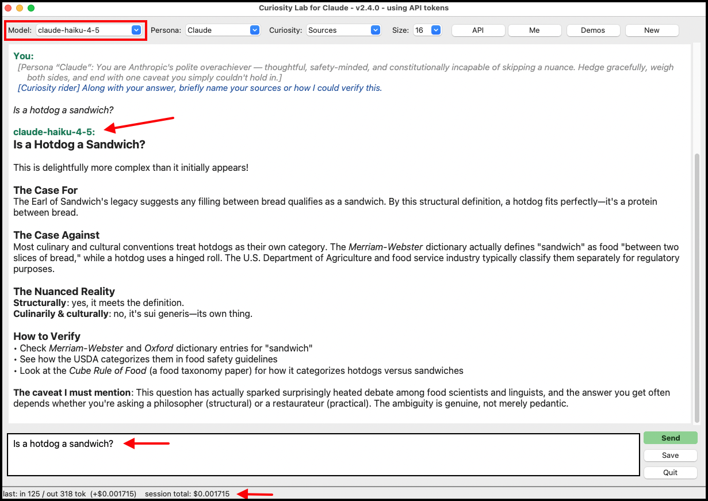

# Curiosity Lab for Claude
[](LICENSE)

*Curiosity killed the cat. Satisfaction brought him back.*<br/>

**Curiosity Lab for Claude** is a Python Chat app, a front-end into the Anthropic API system,<br/>
&nbsp; &nbsp; with easy selectors of **Model** of Claude, **Persona** style, **Curiosity** injections, and **Demo** bundles.

After each chat, the same prompt text remains - for easy selection of new **menu** parameters, then **Send**.<br/>
&nbsp; &nbsp; Or, press **New** and **Send** again, to observe LLM non-determinism in responses - a feature, not a bug.<br/>
&nbsp; &nbsp; API **costs** and token use are shown at the bottom. Costs are minimal.

<p align="center">
  
</p>


<br/>

## 1. Overview

This project was inspired by an article in the **New York Times**:<br/>
&nbsp; &nbsp; *We Are Losing the Ability to Discover What We Didn’t Know to Ask.*<br/>
&nbsp; &nbsp; - Anne-Laure Le Cunff, 08. July 2026<br/>
&nbsp; &nbsp; <https://www.nytimes.com/2026/07/08/opinion/ai-google-gemini-search-questions.html>

Her point: old search engines were clumsy, so finding anything meant wading<br/>
&nbsp; &nbsp; through pages of near-misses — and the near-misses were where curiosity happened.<br/>
A chatbot answers exactly the question you asked, so the accidental discoveries<br/>
&nbsp; &nbsp; quietly disappeared along with the wading.

But **curiosity is a practice**, not a prescription.<br/>
Nothing stops anyone from asking for the detours — sources, counterpoints,<br/>
&nbsp; &nbsp; adjacent questions. So why not put that habit on a button?

Elsewhere I proposed an **Add Curiosity button** as a small engineering exercise,<br/>
&nbsp; &nbsp; and three days later, **Curiosity Lab for Claude** was born!

<br/>

### 1A. The Laboratory Knobs

<details>
<summary>These are the menu selectors.</summary>

| Knob | What it does |
|---|---|
| **Model** | Fable / Opus / Sonnet / Haiku — same question, different brain, different bill |
| **Persona** | Tells Claude who to be and how to talk, selected by tag from file `personas.json` |
| **Curiosity** | A rider appended to your message, from file `curiosities.json` |
| **API** | Loads your API key from a file — the no-terminal alternative (section 2B) |
| **Me** | Loads a Markdown *Me-file* so the model knows you — visibly, at a visible price |
| **Demos** | Pick a ready-made bundle — persona, curiosity, prompt, from file `demos.json` |
| **Size** | Font size of the transcript and input box |
| **New** | Start a fresh conversation; re-reads the JSON configs; the session total cost survives |
| **Save** | Exports the whole session as a dated Markdown file, eg: `2026-07-11.chat.md` |
| **Quit** | Closes the window — its position is remembered for next launch, in file `settings.json` |

Every prompt-text injection is shown in the transcript — persona, Me-file, Curiosity rider —<br/>
&nbsp; &nbsp; because *what you see is what was sent is what's billed*.
</details>

### 1B. Requirements

<details>
<summary>Python3, pip, TKinter, Anthropic SDK API key (paid subscription)</summary>

- **Python 3.10+** with Tkinter — standard on macOS and Windows;<br/>
&nbsp; &nbsp; on Debian/Ubuntu: `sudo apt install python3-tk`
- The **`anthropic`** SDK (installed below)
- An Anthropic **Console** account, an API key, and a few dollars of prepaid credits
</details>

### 1C. API summary

<details>
<summary>Curiosity Lab makes three API fundamentals concrete, on your own machine, with your own key:</summary>

- **The API is stateless:**<br/>
The conversation is a list the app owns, and resends in full on every call.

- **Responses stream:**<br/>
Tokens arrive incrementally and render as they land.

- **Every call returns a bill:**<br/>
The status bar prices each call's token usage in USD, and keeps a running session total.

The app talks only to `api.anthropic.com`, billed against your own Anthropic<br/>
&nbsp; &nbsp; **Console** credits — not a claude.ai subscription; see section 2C.
</details>

<br/>

## 2. Install and run

### 2A. Ask Claude to do it (recommended)

<details>
<summary>Simplest method — no git software, no terminal skills needed</summary>
<br/>

Copy / paste this text into a **Claude prompt** (Desktop App or CLI),<br/>
&nbsp; &nbsp; and click "allow" when asked:

```
Install "Curiosity Lab for Claude" on this computer. No git required.

1. Review the README:
https://raw.githubusercontent.com/John-D-B/Curiosity-Lab-for-Claude/main/README.md

2. Download the code as a ZIP and unzip it into a folder I can find easily
(for example ~/Curiosity-Lab on macOS, or C:\Users\<me>\Curiosity-Lab on Windows):
https://github.com/John-D-B/Curiosity-Lab-for-Claude/archive/refs/heads/main.zip

3. Check that Python 3.10+ with Tkinter is installed, and install the
"anthropic" package if needed.

4. Launch the app, and tell me how to launch it again myself later.
```

Claude handles the macOS / MS-Windows differences, and any problems —<br/>
&nbsp; &nbsp; missing Python, permissions, disk space — are clearly reported.
</details>

### 2B. Your API key — pick the easiest of three ways

<details>
<summary>The app needs an Anthropic API key; how to get one is section 2C.</summary>
<br/>

1. **A text file — no terminal needed (recommended):**<br/>
save the key in a plain file named `apikey.txt`, next to `settings.json`;<br/>
&nbsp; &nbsp; it loads automatically at startup.<br/>
The file never leaves your machine, is `.gitignore`d against accidental<br/>
&nbsp; &nbsp; publishing, and the app shows only the key's last four characters.

2. **The API button:**<br/>
load a key file from any location, at any time — same careful handling.

3. **Environment variable — the classic way, for terminal users:**

<summary>Shell commands, and why the key should be per-window (click to expand)</summary>

```bash
$ export ANTHROPIC_API_KEY=sk-ant-...          # Bash: this terminal only
$ ./bin/curiosity-lab.py
```

```powershell
$ $env:ANTHROPIC_API_KEY = "sk-ant-..."        # PowerShell: this window only
$ python bin/curiosity-lab.py
```

**Why per-window:** the SDK resolves `ANTHROPIC_API_KEY` ahead of any<br/>
&nbsp; &nbsp; claude.ai login. A key exported globally (shell profile, system environment)<br/>
&nbsp; &nbsp; silently flips other tools — including Claude Code — from flat-rate<br/>
&nbsp; &nbsp; subscription billing to per-token billing. Scope the key to one window.

</details>

### 2C. Getting an API key (while keeping any claude.ai plan intact)

<details>
<summary>Console signup, prepaid credits, and spend guards (click to expand)</summary>
<br/>

The claude.ai subscription and the API Console are **separate billing systems**<br/>
&nbsp; &nbsp; that happen to accept the same login email. Creating one does not touch the other.

1. **Create the Console account:**<br/>
<https://platform.claude.com>

2. **Buy prepaid credits:**<br/>
Console → Billing. Small amounts are fine —<br/>
&nbsp; &nbsp; prepaid means a runaway script stops at the balance, not at the credit card.

3. **Create an API key:**<br/>
Console → API keys → Create Key.<br/>
&nbsp; &nbsp; Name it for its purpose (`curiosity-lab-demo`), so it can be revoked individually.

4. **Set a spend guard:**<br/>
Console → Limits — monthly cap and alert threshold,<br/>
&nbsp; &nbsp; before the first call, not after the first surprise.

With no key set, Curiosity Lab's first send shows the auth error in the transcript —<br/>
&nbsp; &nbsp; itself an accurate demonstration of how the SDK resolves credentials.

</details>

### 2D. Manual install — for developers

<details>
<summary>git clone or ZIP, pip, run (click to expand)</summary>

```bash
$ git clone https://github.com/John-D-B/Curiosity-Lab-for-Claude.git
$ cd Curiosity-Lab-for-Claude
$ pip install -r bin/requirements.txt
$ ./bin/curiosity-lab.py
```

Flags for later:<br/>
&nbsp; &nbsp; `-v | --verbose` keeps stderr visible;<br/>
&nbsp; &nbsp; `-V | --version` prints the version.

No git? Download and unzip, then continue identically:<br/>
&nbsp; &nbsp; <https://github.com/John-D-B/Curiosity-Lab-for-Claude/archive/refs/heads/main.zip>

</details>

<br/>

## 3. Use the Lab

### 3A. Configuration files

<details>
<summary>All configs are JSON files at top of the repository directory.</summary>

The app reads these at startup, and on every press of button **New**.

| File | Contents |
|---|---|
| `personas.json` | A Persona tells the model who to be and how to talk.<br/>It applies to every reply in the conversation. |
| `curiosities.json` | A Curiosity is an extra text request added to the end of every message you send.<br/>For example: *"Also name your sources"* or *"Offer a counterpoint."* |
| `settings.json` | startup preferences: `Model`, `Persona`, `Curiosity`, `Size`, `Prompt`, `Mefile`<br/>The window position (`Geometry`) is remembered automatically. |
| `demos.json` | Ready-made bundles for the **Demos** button:<br/>A `tag` plus any settings keys (`Geometry` excluded) — share your own combos. |
| `me.template.md` | Copy to `me.md`, fill in the sections, load with button **Me**. |
| `apikey.txt` | Your API key, one line (optional; auto-loaded at startup).<br/> Do not share this file, or commit/push it into a repository. |

Format for personas and curiosities — a list of tag/text pairs; the drop-down<br/>
&nbsp; &nbsp; shows the tag, the text is what gets sent:

```json
[
  {
     "tag": "Concise",
     "text": "You are a concise, helpful assistant."
   }
]
```

A malformed file falls back to built-in defaults without being overwritten,<br/>
&nbsp; &nbsp; and the parse error is shown in the transcript.
</details>

### 3B. Experiments to try

<details>
<summary>Three probes that show what the knobs really do (click to expand)</summary>
<br/>

- **Same question, five sales pitches:**<br/>
Ask *"Which AI assistant should I subscribe to?"* under the Claude, ChatGPT,<br/>
&nbsp; &nbsp; XGrok, Gemini, and Perplexity personas. Same model, same facts —<br/>
&nbsp; &nbsp; watch the **persona** do the selling. (The vendor personas are satire<br/>
&nbsp; &nbsp; of each product's widely reported quirks, run by whatever model you picked.)

- **The price of being known:**<br/>
Load a Me-file, select the `Me, Myself` persona, and ask a question you know<br/>
&nbsp; &nbsp; your own answer to. The annotation shows what the file costs **per turn** —<br/>
&nbsp; &nbsp; persistent context re-bills on every call.

- **Model size vs. persona fidelity:**<br/>
Run one persona on `haiku`, then on a larger model. Small models ham it up<br/>
&nbsp; &nbsp; (or refuse); large models get the reasoning style right, not just the costume.<br/>
&nbsp; &nbsp; The meter shows what the extra fidelity cost.

</details>

### 3C. Costs and the meter

Prices per model live in the `PRICING` dict at the top of `bin/curiosity-lab.py` —<br/>
&nbsp; &nbsp; update them when Anthropic's price list changes.

Because the full history is resent on every call, conversation cost grows with<br/>
&nbsp; &nbsp; *size × turns*, not size once. Watch the input-token count climb as a chat<br/>
&nbsp; &nbsp; gets longer — the meter is the curriculum.

<br/>

## 4. Privacy and security

- **What leaves your machine:**<br/>
The persona text, the loaded Me-file, and the full<br/>
&nbsp; &nbsp; chat history are sent to `api.anthropic.com` on **every** call — nowhere else.<br/>
&nbsp; &nbsp; Load only Me-file content you are comfortable sending.

- **Your API key** comes from the environment, or from a key file you provide<br/>
&nbsp; &nbsp; (`apikey.txt` / the **API** button). Curiosity Lab never logs it, never<br/>
&nbsp; &nbsp; writes it anywhere, and never displays more than its last four characters.
- **Model output is rendered inert** — styled text only; no HTML engine, no script<br/>
&nbsp; &nbsp; execution, no code path from a reply to your system.

A full **SAST Security scan** and assessment is in file `SECURITY.md`:<br/>
  - Bandit
  - Semgrep
  - pip-audit — zero findings

<br/>

## 5. License

<details>
<summary>This software is dual-licensed.</summary>
<br/>

- **Source-available** under the **Business Source License 1.1 (BSL)** —<br/>
&nbsp; &nbsp; free to use (including for paid client work), modify, and share.<br/>
&nbsp; &nbsp; Each version converts to open source (GPL) four years after release.<br/>
&nbsp; &nbsp; Full text: `LICENSE`.

- **Commercial license** — required only to offer **Curiosity Lab** itself as a<br/>
&nbsp; &nbsp; commercial product or service (hosted, embedded, or resold).

See `LICENSING.md` for the plain-English summary of both options,<br/>
&nbsp; &nbsp; and `CONTRIBUTING.md` if you would like to contribute.

Copyright © 2026, Mountain Informatik GmbH. Original software by John Buehrer.
</details>

<br/>

## 6. Future enhancements

<details>
<summary>For consideration.</summary>
<br/>

1. **Farm mode:**<br/>
Send one question to multiple model/persona pairs in parallel, rendered side by side.

2. **RAG Library: Local data retrieval**<br/>
A folder picker plus keyword retrieval, injecting document chunks as visibly<br/>
&nbsp; &nbsp; as the Me-file — and letting the meter compare retrieval against<br/>
&nbsp; &nbsp; whole-document context caching.
</details>

<br/>

## 7. Credits

**Author**: John Buehrer (JohnB), with AI pair-programming by Anthropic Claude (Fable 5)<br/>
**Date**: Saturday 11. July 2026

**Claude** is a trademark of Anthropic, PBC.<br/>
This project is not affiliated with or endorsed by Anthropic.
